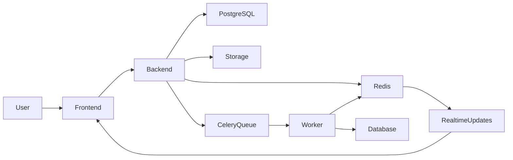
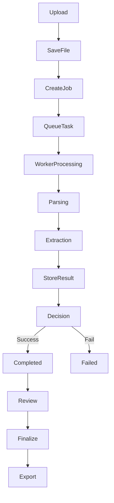
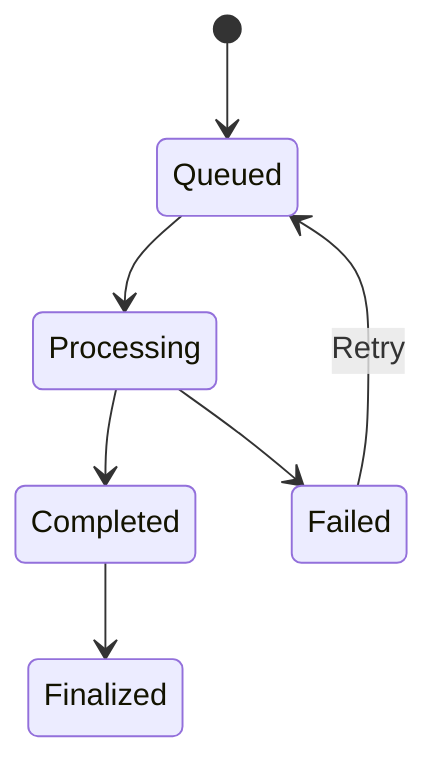

# 🚀 Async Document Processing Workflow System

> A scalable full-stack application for uploading documents, processing them asynchronously, tracking real-time progress, reviewing extracted data, and exporting finalized results.

---

## 📌 Overview

This project demonstrates a **real-world document processing pipeline** where users can upload files and track their processing lifecycle in real time.

Instead of handling heavy operations inside API requests, the system leverages **asynchronous background workers** to ensure performance, scalability, and reliability.

It focuses on:

* clean system architecture
* async execution using queues
* real-time progress updates
* human-in-the-loop validation

---

## 🎯 Problem Statement

Manual document workflows are often:

* slow and repetitive
* difficult to track
* error-prone

Teams dealing with invoices, resumes, or contracts require:

* structured storage
* background processing
* status visibility
* manual review
* retry mechanisms
* export capabilities

This system solves these challenges using a **modern async architecture**.

---

## 💼 Real-World Use Case

### Invoice Processing System

1. User uploads invoice documents
2. Backend creates processing jobs
3. Celery workers process documents asynchronously
4. Progress updates are streamed in real-time
5. Extracted data is reviewed and corrected
6. Approved documents are finalized
7. Final output is exported (JSON / CSV)

---

## 🧰 Tech Stack

### Frontend

* Next.js (TypeScript)
* Tailwind CSS
* TanStack Query
* React Hook Form
* WebSockets / SSE

### Backend

* FastAPI (Python)
* SQLAlchemy / SQLModel
* Pydantic
* Alembic

### Async & Messaging

* Celery (task queue)
* Redis (broker + Pub/Sub)

### Database & Infra

* PostgreSQL
* Docker Compose
* Local file storage

---

## ⚙️ Core Features

* 📤 Upload single or multiple documents
* ⚡ Async background processing
* 📊 Job states: `Queued`, `Processing`, `Completed`, `Failed`
* 📡 Real-time progress tracking
* 🔍 Search, filter, and sort documents
* ✏️ Review and edit extracted data
* ✅ Finalize approved results
* 🔁 Retry failed jobs
* 📁 Export to JSON / CSV

---

## 🏗️ System Architecture



---

## 🔄 Processing Flow



---

## 🔁 Job Lifecycle



---

## 📡 Progress Events

* job_queued
* job_started
* parsing_started
* parsing_completed
* extraction_started
* extraction_completed
* job_completed
* job_failed

---

## 🌐 API Endpoints

### Documents

* `POST /api/documents/upload`
* `GET /api/documents`
* `GET /api/documents/{id}`

### Jobs

* `GET /api/jobs/{id}`
* `POST /api/jobs/{id}/retry`
* `GET /api/jobs/{id}/events`
* `GET /api/jobs/{id}/stream`

### Review

* `PUT /api/documents/{id}/review`
* `POST /api/documents/{id}/finalize`

### Export

* `GET /api/documents/{id}/export/json`
* `GET /api/documents/{id}/export/csv`

---

## 🗄️ Database Design

### Documents

* id
* original_filename
* stored_file_path
* mime_type
* file_size
* uploaded_at
* status

### Processing Jobs

* id
* document_id
* status
* progress
* stage
* error_message
* retry_count
* timestamps

### Extracted Results

* id
* document_id
* raw_text
* structured_output
* reviewed_output
* is_finalized
* finalized_at

---

## 🖥️ Frontend Pages

* Upload page
* Dashboard with job tracking
* Document detail view
* Review & edit page
* Finalization & export page

---

## 👤 User Flow

1. Upload documents
2. Jobs are created
3. Workers process asynchronously
4. Progress updates are streamed
5. Failed jobs can be retried
6. Completed jobs go to review
7. User edits extracted data
8. User finalizes document
9. Export final result

---

## ⚠️ Error Handling

* Invalid uploads are rejected early
* Failed jobs store error details
* Retry mechanism available
* Progress includes failure states
* Finalization ensures consistency

---

## ⭐ Future Improvements

* Authentication (JWT)
* Cloud storage (S3)
* Job cancellation
* Bulk processing optimization
* Advanced OCR / AI extraction

---

## 🚀 Getting Started

```bash
# Clone repo
git clone <your-repo-url>

# Run with Docker
docker-compose up --build
```

---

## 📦 Deliverables

* Source code (GitHub)
* Sample documents
* Exported outputs
* Demo video

---

## 📝 Notes

* Focus is on system design, not AI accuracy
* Local storage is used for demonstration
* Real-time updates are near-live

---

## 📚 Reference

Based on system requirements:
